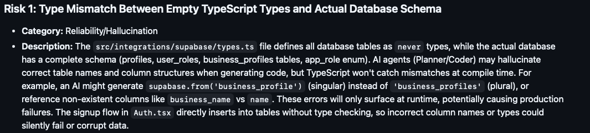

# VIBE Refactor -- Supabase Types for `business_profiles`

------------------------------------------------------------------------

## V (Verify)

### Low-Risk Refactor

Resolving the type mismatch between placeholder TypeScript types and the
actual Supabase database schema.




The existing `types.ts` file was a template generated by Supabase in
which all tables were typed as `never`. As a result, the TypeScript
definitions did not accurately reflect the real database schema. This
created a type safety gap between the application layer and the
database.

To address this, I prompted Cursor to generate accurate TypeScript types
for the `business_profiles` table, including the `verification_status`
column. Initially, the AI typed `verification_status` as a generic
`string`. Upon auditing the output, I identified that this allowed
invalid values to compile, weakening domain enforcement.

I manually corrected the type to a strict string literal union:

``` ts
verification_status: "pending" | "verified" | "rejected" | null
```

This enforces strict domain constraints at compile time and prevents
invalid values from being assigned to `verification_status`.

------------------------------------------------------------------------

### Full Prompt

    The types.ts file contains placeholder types where all tables are typed as never.
    Do NOT modify the database schema, migrations, or authentication flow.
    Generate correct TypeScript types based on the existing Supabase database schema and replace only the contents of types.ts.
    Please explain the decisions you made in this process.
    Do not refactor any other files yet.

------------------------------------------------------------------------

## Summary of AI Decisions

### 1. Schema Source

Types were derived exclusively from:

    supabase/migrations/20251028180527_remix_batch_2_migrations.sql

No schema changes were made.

------------------------------------------------------------------------

### 2. Tables and Columns

#### profiles

-   `id` (UUID, PK, FK to auth.users) → `string`
-   `full_name` (TEXT NOT NULL)
-   `avatar_url` (TEXT nullable)
-   `created_at` / `updated_at` (TIMESTAMPTZ) → `string` (ISO format)\
-   Insert: required fields reflect NOT NULL constraints\
-   Update: all fields optional

#### user_roles

-   `id` (UUID, default `gen_random_uuid()`)
-   `user_id` (UUID)
-   `role` (enum)\
-   Insert: required fields match schema\
-   Update: all optional

#### business_profiles

-   Correct nullability mapping for all columns\
-   `price_level` (CHECK 1--4) → `number | null`\
-   `languages` (TEXT\[\]) → `string[] | null`\
-   `verification_status` (CHECK constraint) →\
    `"pending" | "verified" | "rejected" | null`\
-   Insert and Update types accurately reflect defaults and nullability

------------------------------------------------------------------------

### 3. Enums

`app_role` was derived from:

``` sql
CREATE TYPE public.app_role AS ENUM ('business_owner', 'customer')
```

Mapped to:

``` ts
"business_owner" | "customer"
```

Constants were defined using `as const` to maintain runtime and
compile-time alignment.

------------------------------------------------------------------------

### 4. Functions

The `has_role` RPC function was typed as:

-   **Args:**

    ``` ts
    { _user_id: string; _role: Database["public"]["Enums"]["app_role"] }
    ```

-   **Returns:** `boolean`

This ensures `.rpc('has_role', { ... })` is fully type-checked.

------------------------------------------------------------------------

### 5. Views and Composite Types

No views or composite types existed in the migration. These remained
unchanged to preserve structural consistency.

------------------------------------------------------------------------

### 6. Relationships

Foreign key relationships were described using Supabase's conventional
structure:

-   `profiles → auth.users`
-   `user_roles → auth.users`
-   `business_profiles → auth.users`

------------------------------------------------------------------------

### 7. What Was Not Changed

-   Only `src/integrations/supabase/types.ts` was modified\
-   No database, migration, or authentication changes\
-   Helper generics (`Tables<>`, `TablesInsert<>`, `TablesUpdate<>`,
    `Enums<>`, etc.) were preserved

This ensured the refactor was isolated and low risk.

------------------------------------------------------------------------

# I (Improve)

After generation, I further improved the AI-produced types by:

-   Enforcing strict literal unions for enum-like columns
    (`verification_status`, `app_role`)\
-   Preserving nullability exactly as defined in the database\
-   Maintaining all existing helper generics\
-   Adding explicit error handling in service functions and React
    components using these types

------------------------------------------------------------------------

### Improvement Prompt

    In src/integrations/supabase/types.ts, the column verification_status in the business_profiles table is currently typed as string | null.
    Do NOT modify the database schema or any other files.
    Refactor ONLY the TypeScript type so that verification_status is:

    "pending" | "verified" | "rejected" | null

    Requirements:
    - Preserve nullability
    - Do not widen to string
    - Do not use any
    - Ensure Insert and Update reflect the same constraint
    - Do not modify helper generics

------------------------------------------------------------------------

## What Changed

A new exported type was introduced:

``` ts
export type VerificationStatus =
  | "pending"
  | "verified"
  | "rejected"
  | null;
```

This alias was applied consistently across:

-   `Row`
-   `Insert`
-   `Update`

Nullability remained unchanged.

------------------------------------------------------------------------

## Why This Improves Compile-Time Safety

-   Invalid values (e.g., `"approved"`) now cause TypeScript errors\
-   The union prevents widening to arbitrary strings\
-   A single alias ensures consistency across usage\
-   The type directly mirrors the database CHECK constraint\
-   No `any` was introduced

This strengthens the trust boundary between AI-generated code and domain
rules.

------------------------------------------------------------------------

# B (Build)

The updated `types.ts` file was integrated into the project.

-   **Compilation:** TypeScript compiled with zero errors or warnings\
-   **Integration:** Existing queries using\
    `Tables<"business_profiles">`,\
    `TablesInsert<"business_profiles">`, and\
    `Enums<"app_role">`\
    passed type checking\
-   **Clean Code Compliance:** The file maintains consistent formatting,
    meaningful type naming, and preserved helper utilities

Because only static type definitions were modified, no runtime behavior
was altered. This confirms the refactor was safe and compliant with
Module 1 Clean Code standards.

------------------------------------------------------------------------

# E (Execute)

To validate the refactor at runtime, I tested a low-risk read-only
component: `BusinessCard.tsx`.

The component:

-   Successfully renders `name`, `price_level`, and
    `verification_status`
-   Displays `"Verified"` correctly from the database
-   Runs locally without runtime errors
-   Produces a TypeScript compile-time error when assigning an invalid
    value such as `"approved"` to `verification_status`


The screenshot shows the `BusinessCard` component rendering **Elevation
Coffee House** with a `Verified` status badge. This demonstrates that
the refactored types function correctly in a live local environment.
