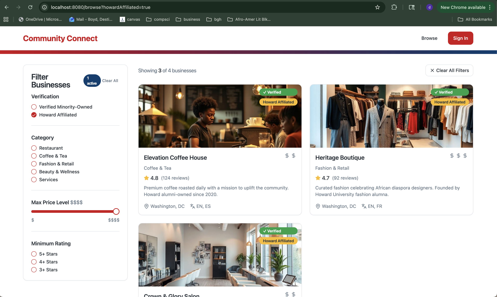

# Destiny - Lab 2
### VIBE Report

**1. Target Selected:**
 FilterSidebar.tsx and Browse.tsx was the componet chosen to refactor because it met all the requirements of being isolated, has clear inputs/outputs, and addresses a documented inefficiency without risking broader application stability. It was a low risk componet that was not critical to the functionality of the application.

**2. The Verification Event:**
 The AI suggested that I move the filtering logic from the Browse component to the FilterSidebar component using a local useEffect. 

    // AI suggestion
        const FilterSidebar = ({ businesses, onFilterChange }) => 
        const [localFilters, setLocalFilters] = useState({});
        useEffect(() => {
            const filtered = businesses.filter(/* ... */);
            onFilterChange(filtered);          // ← passing filtered data, not filter state
        }, [localFilters, businesses]);

 I rejected this because it seemed like it would make the FilterSidebar component more complex and harder to maintain since it is a UI component. Due to this, it shouldn't be in charge of storing any business logic or data. Passing business data to the FilterSidebar component makes it harder to test.

    // Final implementation
    interface FilterSidebarProps {
    filters: FilterState;              // ← state owned by Browse, passed down
    onFilterChange: (filters: FilterState) => void;
    }

 My final implemtation keeps the sidebar as a UI component that is only in charge of displaying the filters and handling the user input. It passes the filter state up to the Browse component, which is in charge of storing the filter state and filtering the businesses via applyFilters() function memoized with useMemo.

**3. Trust Boundary Established:**
This refactor makes the system more stable by keeping the UI components simple and testable. It also makes the system more efficient by using useMemo to memoize the filtered businesses. 

**4. Evidence of Execution: Screenshots of Test:**

