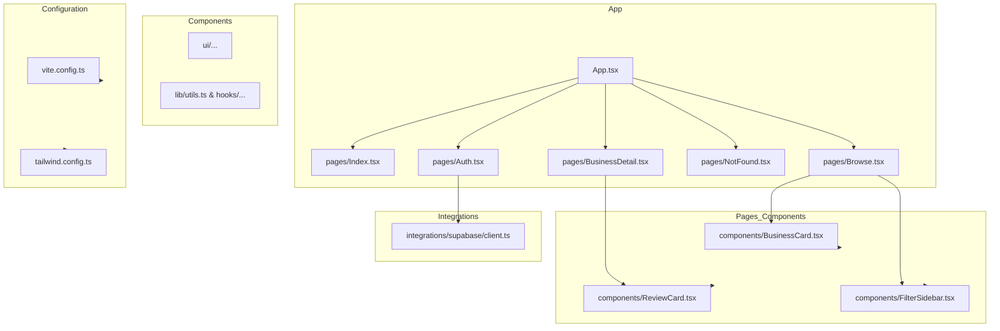

    

    <b>Automatic Architecture Diagrams from Code</b> 
    <a href="https://github.com/swark-io/swark">GitHub</a> • <a href="https://swark.io">Website</a> • <a href="mailto:contact@swark.io">Contact Us</a>

## Usage Instructions

1. **Render the Diagram**: Use the links below to open it in Mermaid Live Editor, or install the [Mermaid Support](https://marketplace.visualstudio.com/items?itemName=bierner.markdown-mermaid) extension.
2. **Recommended Model**: If available for you, use `claude-3.5-sonnet` [language model](vscode://settings/swark.languageModel). It can process more files and generates better diagrams.
3. **Iterate for Best Results**: Language models are non-deterministic. Generate the diagram multiple times and choose the best result.

## Generated Content
**Model**: GPT-4o - [Change Model](vscode://settings/swark.languageModel)  
**Mermaid Live Editor**: [View](https://mermaid.live/view#pako:eNp9lE1v2zAMhv-KoMNOrX3PYUCbrkAuRbG0u0zDoFhMLMyWDIlqGhT975Pt-INx1JNN8qGk96XlD15YBXzFhTk42ZTs5V4YxnzY9eFd07Qxa19-GHSnZ6sN_hY8xhn6d8H_9PWNUfD-LA8Qa018-LzLEObe2aMHAvUpSgWvDXj_ACh1RWlSIl1PFh9tMIrwQ5KQdwFLQrUJQlxRzG5vv08aU8AkMEksxKXIuaAUM0hp62CUMGR2a1s31oBB3_e_bqZMFB90nmXZKPoVdaXxRJBK7_IQ8z7aw76x0tp_fta03LI9jP97ufEgei2dGmtx-WLk8jlCZvET3jQcv-icANL3qCsEt9UKdtIlWgkz6x51XcohIyRnStJXzp9kr5_5wuKNQYhvqK0527sNjdxJD-tK9xL1DMn9uZoXXTnKTE5vbc1eH0Lf2a_9SyP06bjuWwyyooumZRh7iV_yURs1cnhOLNhxy-mifCl8ASa9X96rtPstP9ycjqIGtmXiRMdMRlyvUxOE4Te8BldLreLP9SN6UkINgq-Y4Ar2MlQo-GeEQqMkwoOWcQQ1X6ELcMNlQLs9mWKInQ2Hkq_2svLw-R9xhgHJ) | [Edit](https://mermaid.live/edit#pako:eNp9lE1v2zAMhv-KoMNOrX3PYUCbrkAuRbG0u0zDoFhMLMyWDIlqGhT975Pt-INx1JNN8qGk96XlD15YBXzFhTk42ZTs5V4YxnzY9eFd07Qxa19-GHSnZ6sN_hY8xhn6d8H_9PWNUfD-LA8Qa018-LzLEObe2aMHAvUpSgWvDXj_ACh1RWlSIl1PFh9tMIrwQ5KQdwFLQrUJQlxRzG5vv08aU8AkMEksxKXIuaAUM0hp62CUMGR2a1s31oBB3_e_bqZMFB90nmXZKPoVdaXxRJBK7_IQ8z7aw76x0tp_fta03LI9jP97ufEgei2dGmtx-WLk8jlCZvET3jQcv-icANL3qCsEt9UKdtIlWgkz6x51XcohIyRnStJXzp9kr5_5wuKNQYhvqK0527sNjdxJD-tK9xL1DMn9uZoXXTnKTE5vbc1eH0Lf2a_9SyP06bjuWwyyooumZRh7iV_yURs1cnhOLNhxy-mifCl8ASa9X96rtPstP9ycjqIGtmXiRMdMRlyvUxOE4Te8BldLreLP9SN6UkINgq-Y4Ar2MlQo-GeEQqMkwoOWcQQ1X6ELcMNlQLs9mWKInQ2Hkq_2svLw-R9xhgHJ)

