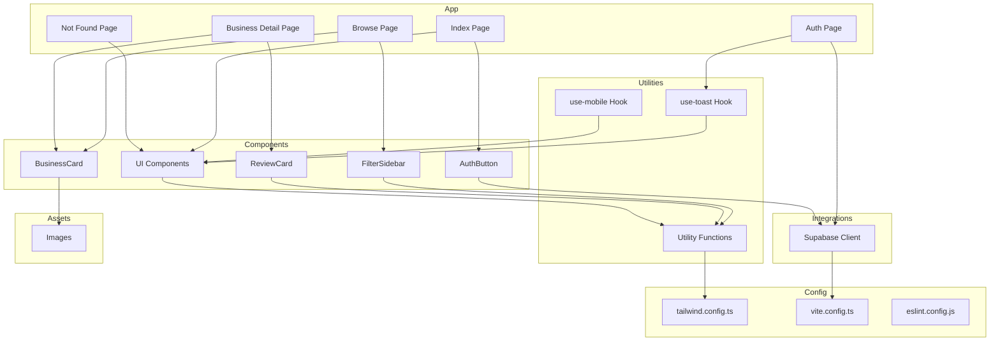

    

    <b>Automatic Architecture Diagrams from Code</b> 
    <a href="https://github.com/swark-io/swark">GitHub</a> • <a href="https://swark.io">Website</a> • <a href="mailto:contact@swark.io">Contact Us</a>

## Usage Instructions

1. **Render the Diagram**: Use the links below to open it in Mermaid Live Editor, or install the [Mermaid Support](https://marketplace.visualstudio.com/items?itemName=bierner.markdown-mermaid) extension.
2. **Recommended Model**: If available for you, use `claude-3.5-sonnet` [language model](vscode://settings/swark.languageModel). It can process more files and generates better diagrams.
3. **Iterate for Best Results**: Language models are non-deterministic. Generate the diagram multiple times and choose the best result.

## Generated Content
**Model**: GPT-4o - [Change Model](vscode://settings/swark.languageModel)  
**Mermaid Live Editor**: [View](https://mermaid.live/view#pako:eNp9U8FuozAQ_RXkc1MJKJccVgJc1FxWq832ZHpw4kniFmyEx81WVf-9Liat3VTxiTfP895jBl7JVgsgS9Kq_ciHQ_KPtipxx9iNL5TD4Csfp0zZSgn4n_zhe3gI6hmrRn00cEbkrLJGKjAmoYBcdmc3blhp8XBWLthvjUmjrRIhB0q06lvEWveDVqDQfPVX6adxzUcRKFcZa2SHMK6lgA0fQypnf-FZwvF7i89YWUStwnrB7leB_YWMK4XgnlBqFaSsU7a2A99wN7m6k07jgsQ9yk6ihKCfpswaWKDmBpM7rZ-CcDSbuF5vZAdnZM683EvSWLWdYl2wLo2BcLq37jvo3VLMxa2ondx_9TQp-9j_USpxvZ2468-JTXzGniXCz1zOwHRS4Yl9_MG5TJPF4pdbVgyLGWYepjHMZph7mMfwdPlmgnUM6QkWkVHlfW9ntvJGdFau8hjGylURsbWXauaQNH4jmsXQKzdOilyRHsaeS-H-7NeW4AF6aMkyaYmAHbcdtuTNXbKD4AhUcrexnixxtHBFuEW9flHbEx613R_Icsc7A2_v0MEv6Q) | [Edit](https://mermaid.live/edit#pako:eNp9U8FuozAQ_RXkc1MJKJccVgJc1FxWq832ZHpw4kniFmyEx81WVf-9Liat3VTxiTfP895jBl7JVgsgS9Kq_ciHQ_KPtipxx9iNL5TD4Csfp0zZSgn4n_zhe3gI6hmrRn00cEbkrLJGKjAmoYBcdmc3blhp8XBWLthvjUmjrRIhB0q06lvEWveDVqDQfPVX6adxzUcRKFcZa2SHMK6lgA0fQypnf-FZwvF7i89YWUStwnrB7leB_YWMK4XgnlBqFaSsU7a2A99wN7m6k07jgsQ9yk6ihKCfpswaWKDmBpM7rZ-CcDSbuF5vZAdnZM683EvSWLWdYl2wLo2BcLq37jvo3VLMxa2ondx_9TQp-9j_USpxvZ2468-JTXzGniXCz1zOwHRS4Yl9_MG5TJPF4pdbVgyLGWYepjHMZph7mMfwdPlmgnUM6QkWkVHlfW9ntvJGdFau8hjGylURsbWXauaQNH4jmsXQKzdOilyRHsaeS-H-7NeW4AF6aMkyaYmAHbcdtuTNXbKD4AhUcrexnixxtHBFuEW9flHbEx613R_Icsc7A2_v0MEv6Q)

